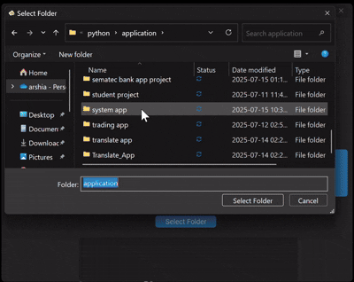

# 🖼️ Photo Slider with OCR (Text Extraction Tool)

This project is a modern and user-friendly desktop application built with **CustomTkinter**, which allows users to:

- 📂 **Select a folder** containing images
- 🖼️ **Navigate through images** with next/previous buttons
- 🔍 **Extract text** from the displayed image using Tesseract OCR (supports Persian and English)
- 🧠 **Display the extracted text** in a clean text box

---

## 🚀 Features

| Feature             | Description                                                             |
| ------------------- | ----------------------------------------------------------------------- |
| 📁 Folder Selection | Select a directory and automatically load all supported image files     |
| ⬅️➡️ Navigation     | Navigate back and forth through images in the folder                    |
| 📸 Image Display    | View selected image in a resized format within the GUI                  |
| 🧾 OCR Text Output  | Use Tesseract OCR to extract text from image and display it dynamically |
| 🌐 Multilingual OCR | Persian (`fas`) and English (`eng`) text extraction supported           |

---

## 🧠 How the App Works (Algorithm Insight)

### 🔄 Initialization

- On start, a `CTk` window is created with fixed dimensions and icon.
- Two navigation icons (`forward.png`, `back.png`) are loaded and attached to buttons.

### 📂 Image Loading

- When a folder is selected, all valid image extensions are filtered and stored in `self.image_list`.
- The current image index is set to `0`, and the first image is displayed.

### 🖼️ Image Display Logic

```python
image = Image.open(image_path)
image = image.resize((500, 400), Image.LANCZOS)
photo = ImageTk.PhotoImage(image)
```

- Images are resized for consistency.
- Displayed using a `CTkLabel` widget with `image` binding.

### 🧾 OCR Extraction

```python
text = pytesseract.image_to_string(image, lang='fas+eng')
```

- Uses Tesseract OCR to extract both Persian and English text.
- Output is rendered inside a `CTkTextbox`.

### 🔁 Navigation Buttons

- Buttons trigger `prev_image()` and `next_image()` methods.
- Index is updated and the image display is refreshed.

---

## 📂 Folder Structure

```
photo-slider-app/
├── main.py                # Main application file
├── back.png               # Back button icon
├── forward.png            # Forward button icon
├── images.png             # App window icon
├── README.md              # Project documentation
├── requirements.txt       # Required Python libraries
```

---

## 📦 Requirements

### 🐍 Python Libraries

```txt
customtkinter==5.2.1
pillow==10.3.0
pytesseract==0.3.10
```

Install all with:

```bash
pip install -r requirements.txt
```

### 🛠️ External Dependency

Make sure **Tesseract OCR** is installed and added to your system PATH:

- Windows: [https://github.com/tesseract-ocr/tesseract](https://github.com/tesseract-ocr/tesseract)
- (Optional) Uncomment and set this line if not in PATH:

```python
pytesseract.pytesseract.tesseract_cmd = r'C:\Program Files\Tesseract-OCR\tesseract.exe'
```

---

## 🔍 Sample Use Case

1. Launch the application
2. Select a folder with images (`.png`, `.jpg`, `.jpeg`, `.bmp`, `.gif`)
3. Click through images using arrows
4. Click **Extract Text** to see the OCR result!

---

## 💡 Future Enhancements

- 🔤 Language switcher for OCR
- 💾 Export extracted text to file
- 🌍 OCR over multiple images at once
- 🧪 Add preprocessing (e.g. grayscale, thresholding) for better OCR accuracy

---

## 📸 Screenshot



---
